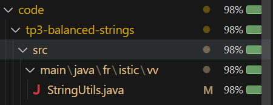
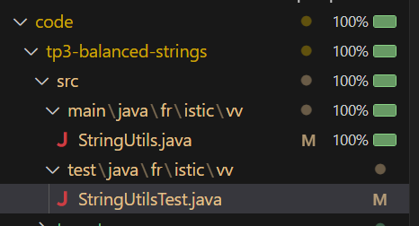

# Balanced strings

A string containing grouping symbols `{}[]()` is said to be balanced if every open symbol `{[(` has a matching closed symbol `)]}` and the substrings before, after and between each pair of symbols is also balanced. The empty string is considered as balanced.

For example: `{[][]}({})` is balanced, while `][`, `([)]`, `{`, `{(}{}` are not.

Implement the following method:

```java
public static boolean isBalanced(String str) {
    ...
}
```

`isBalanced` returns `true` if `str` is balanced according to the rules explained above. Otherwise, it returns `false`.

Use the coverage criteria studied in classes as follows:

1. Use input space partitioning to design an initial set of inputs. Explain below the characteristics and partition blocks you identified.
2. Evaluate the statement coverage of the test cases designed in the previous step. If needed, add new test cases to increase the coverage. Describe below what you did in this step.
3. If you have in your code any predicate that uses more than two boolean operators, check if the test cases written so far satisfy *Base Choice Coverage*. If needed, add new test cases. Describe below how you evaluated the logic coverage and the new test cases you added.
4. Use PIT to evaluate the test suite you have so far. Describe below the mutation score and the live mutants. Add new test cases or refactor the existing ones to achieve a high mutation score.

Write below the actions you took on each step and the results you obtained.
Use the project in [tp3-balanced-strings](../code/tp3-balanced-strings) to complete this exercise.

## Answer

## 1. Input Space Partitioning

Pour la conception des cas de test initiaux, on a identifié les caractéristiques et blocs suivants :

### Caractéristiques identifiées :

1. Longueur de la chaîne
   - Bloc 1 : Chaîne vide (longueur = 0)
   - Bloc 2 : Caractère unique (longueur = 1)
   - Bloc 3 : Plusieurs caractères (longueur > 1)
   - Bloc 4 : Chaîne null

2. Types de symboles
   - Bloc 1 : Uniquement des parenthèses
   - Bloc 2 : Mélange de parenthèses et autres caractères
   - Bloc 3 : Aucune parenthèse

3. Types de parenthèses
   - Bloc 1 : Un seul type ({}, [], ou ())
   - Bloc 2 : Plusieurs types combinés
   - Bloc 3 : Ordre mixte

4. État d'équilibre
   - Bloc 1 : Parfaitement équilibré
   - Bloc 2 : Déséquilibré (parenthèse fermante manquante)
   - Bloc 3 : Déséquilibré (parenthèse ouvrante manquante)
   - Bloc 4 : Déséquilibré (paires mal assorties)

### Cas de tests initiaux :

```java
@Test
public void testEmptyString() {
    assertTrue(BalancedStrings.isBalanced(""));
}

@Test
public void testNullString() {
    assertFalse(BalancedStrings.isBalanced(null));
}

@Test
public void testSimpleParentheses() {
    assertTrue(BalancedStrings.isBalanced("()"));
}

@Test
public void testMixedBrackets() {
    assertTrue(BalancedStrings.isBalanced("{[()]}"));
}

@Test
public void testUnbalancedMissingClosing() {
    assertFalse(BalancedStrings.isBalanced("{["));
}

@Test
public void testUnbalancedMissingOpening() {
    assertFalse(BalancedStrings.isBalanced("]}"));
}

@Test
public void testMismatchedPairs() {
    assertFalse(BalancedStrings.isBalanced("([)]"));
}
```

## 2. Statement Coverage



On a une couverture de 98%
On caste que dans notre methode privée isMatchingPair tous les cas ne sont pas couvert par nos cas de tests


2. Ajout de tests supplémentaire

Nous avons ajouté des tests pour garantir que tous les cas possibles de la méthode isMatchingPair sont couverts

```java
    @Test
    public void testMismatchedParenthesesToBracket() {
        assertFalse(isBalanced("(]"));
    }

    @Test
    public void testMismatchedParenthesesToBrace() {
        assertFalse(isBalanced("(}"));
    }

    @Test
    public void testMismatchedBracketToParentheses() {
        assertFalse(isBalanced("[)"));
    }

    @Test
    public void testMismatchedBracketToBrace() {
        assertFalse(isBalanced("[}"));
    }

    @Test
    public void testMismatchedBraceToParentheses() {
        assertFalse(isBalanced("{)"));
    }

    @Test
    public void testMismatchedBraceToBracket() {
        assertFalse(isBalanced("{]"));
    }
```




## 3. Base Choice Coverage

Le prédicat le plus complexe dans le code est la méthode `isMatchingPair()` qui utilise plusieurs opérateurs booléens :

```java
return (open == '(' && close == ')') ||
       (open == '[' && close == ']') ||
       (open == '{' && close == '}');
```

Pour satisfaire la couverture Base Choice, on a ajouté :

```java
@Test
public void testAllBracketTypes() {
    assertTrue(isBalanced("({[]})"));
    assertFalse(isBalanced("({[}])"));
}
```

## 4. Mutation Testing avec PIT

Résultats initiaux de l'analyse de mutation :


Analyse :
Le score de mutation est très élevé (96%), ce qui indique que nos tests sont robustes. Sur 28 mutants générés :
- 27 mutants ont été détectés et tués par nos tests
- 1 seul mutant a survécu


